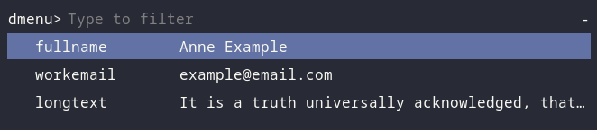

# Tempaste

A microscopic wrapper around rofi, xclip and xdotool to provide text snippets



## Install

1. Install dependencies: `sudo apt install rofi xclip xdotool`
2. Drop the tempaste script into $PATH and make sure it’s executable

## Config

Create a file called `.snippets` in $HOME and fill it with your, uh,
snippets. The file has the following format:

```
# snippet    expanded text
name         Anne Example
email        example@email.com
longtext     It is a truth universally acknowledged, that a single snippet can be long
```

**Note:** Snippets must be a single lower-case word.

### Keyboard Shortcut

Next, set up a keyboard shortcut to run tempaste. This differs depending
on your system, so check the relevant docs. On XFCE its under
settings>keyboard>application shortcuts.

## Usage

If you’re familiar with rofi you know the deal. Hit the keyboard shortcut
(I use super+v), choose from the list, and then the snippet gets pasted
into active window.

## Maybe

The if I get time list:

- multi-line snippets
- support applications that don’t use ctrl+v for paste eg vim, terminals

